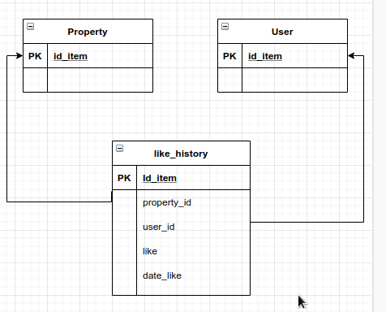

# rest_habi

## Servicio de consulta
La herramienta esta realizada con Djago Rest Framework, debido a mi conocimiento previo con Django y que para fines de está práctica, el tiempo de configuración me fue importante.
A continuación se presentan las librerías que se utilizarón.
```
Django==3.2
djangorestframework==3.12.4
PyMySQL==1.0.2
```

Una de la opciones era no utiliza ORM, y como tengo cierto conocimiento en sentencias SQL, decidi hacer de esta manera. Pero no sabía como ejecutar sentencias SQL directemente, por que lo que me vi en la necesidad de buscar como hacerlo. Y encontré que Django probee el objecto `from django.db import connection` el cual me permitío realizar las consultas para obtener la información necesaria.

El siguiente punto fue obtener las propiedades con actualización reciente y que esten en estado 3,4 o 5. Para este caso realice la consulta apoyandome de JOINS los cuales me permiten relacionar las tablas de acuerdo a un identificador unico y poder aplicar los filtros de estados, ademas también aplique una subconsulta para poder realizar el filtro por fechas:

    select p.address, p.city, s.name, p.price, p.description
    from property p
    inner join status_history sh on p.id = sh.property_id
    inner join status s on s.id = sh.status_id
    where sh.update_date in (select max(update_date) from status_history group by property_id)
    and (status_id = 3 or status_id = 4 or status_id =5)

Una vez obtenido datos de esta consulta, el aplicar los filtros por año, ciudad, estado, me fue más sencillo,  ya que  solo tuve que agregar la la clausula WHERE dentro de la consulta anterior, para poder aplicarlos filtros.

    SELECT p.address, p.city, s.name, p.price, p.descriptioo sen
    FROM property p
    INNER JOIN status_history sh ON p.id=sh.property_id
    INNER JOIN status s ON s.id=sh.status_id
    WHERE sh.update_date IN(SELECT MAX(update_date) FROM status_history GROUP BY 
    AND (status_id=3 OR status_id=4 OR status_id=5) AND {clause_sql

También algo que tenía que considerar es escapar los filtros para evitar injecciones SQL. Entonces lo que hice fue armar el string de manera que solo acepte filtros establecidos y eliminar espacio en blanco.

    filter_valids = {'year': 'p.year','city': 'p.city', 'status': 's.name'}
    filters = [f'{filter_valids.get(_filter)}=("{value}")'.replace(' ', '')  for _filter,value in  filter.items()  if _filter in filter_valids.keys()]
    clause_sql =  ' AND '.join(filters)
  
  Con este codigo, me permite jugar con los filtros, ya que se pueden mandar 1 o más filtros y se arma la condición y se agrega al query inicial.
  Una vez obtenido los datos, lo que me restaba es armar la respuesta de acuerdo a como es solicitado.
Entonces lo que hice fue unir unas claves establecidas con los datos traidos de la consulta, además de limpiar los datos, sobretodo datos que sean NONE.

    fields = ['direccion', 'ciudad', 'estado', 'precio_venta', 'descripción']
    for result in results[0]:
	    clen_data = [self.clean_string(s)  for s in result]
	    json_response.append(dict(zip(self.fields, clen_data)))

## Servicio "Me gusta"
Para este servicio mi idea es agregar una tabla extra, que tenga relación con los usuario, con los inmuebles, además de agregar un campo de fecha y uno de más de me_gusta .
Aquí se guardaría el ID del usuario, el ID del inmueble al que le dio me gusta , fecha en que se realizo la acción y el estado 1 o 0 para el campo me_gusta. Y con esto puede tener registro de cuando pudo cambiar de opinion y poder consultar por la fecha más reciente.



## Propuestas y posibles mejoras
Para la base de datos no cambiaría el diseño actual, sin embargo ya que sería un sistema con mucha concurrencia, no estaría de más meter algún sistema de cache para que sean guardadas las consultas más recurrentes.
De igual forma no me inclinaría por las consultas SQl en crudo, se debería aprovechar las bondades que ofrece el framework, y solo en caso de ser necesario, crear consultas SQL.
Dentro de las posibles mejoras serían:
 - Agregar autenticanción con JWT
 - Segmentar las consultas SQL de manera que sea lo más dinamica posible
 - Contemplar más casos de errores.
 - Contemplar más posiblidades de filtros y campos de las bases de datos.
